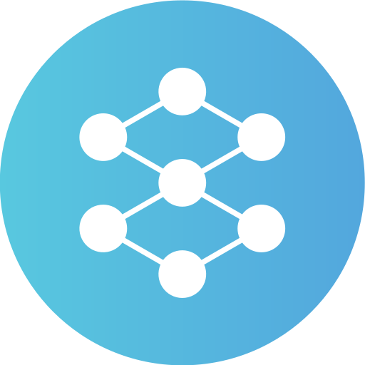

# Interactive Neural Network Visualization



An interactive web-based tool to explore and visualize how neural networks function. Adjust layers, neurons, activation patterns, and visual styles to see real-time changes in a dynamic neural network simulation.

© 2025 Rijul Mahajan | [GitHub](https://github.com/rijul-mahajan)

---

## Table of Contents

- [Overview](#overview)
- [Features](#features)
- [Demo](#demo)
- [Installation](#installation)
- [Usage](#usage)
- [Project Structure](#project-structure)
- [Contributing](#contributing)
- [License](#license)

---

## Overview

This project provides an interactive visualization of a neural network, designed to help users understand the structure and behavior of neural networks. Built with HTML, CSS, and JavaScript, it features a canvas-based simulation where users can tweak parameters like the number of layers, neurons per layer, activation patterns, and visual properties such as colors and glow effects.

The tool is beginner-friendly and educational, offering tooltips and real-time feedback as you interact with the network.

---

## Features

- **Configurable Network:**

  - Adjust the number of layers (2–6).
  - Set neurons per hidden layer (2–12).
  - Choose from three activation patterns: Random, Wave, or Sequential.
  - Control animation speed (0.1x–2x).

- **Customizable Appearance:**

  - Change node and connection colors using color pickers.
  - Adjust glow intensity for active nodes (0.5–3).

- **Interactive Elements:**

  - Hover over nodes to see activation levels (Input, Hidden, or Output layer).
  - Hover over connections to view weights and signal status.
  - Real-time animation of signal propagation.

- **Responsive Design:**

  - Adapts to different screen sizes with a mobile-friendly layout.

- **Reset Functionality:**
  - Restore default settings with a single button.

---

## Demo

Try the live demo [here](#https://rijul-mahajan.github.io/Interactive-Neural-Network-Animation/).

---

## Installation

To run this project locally, follow these steps:

1. **Clone the Repository:**

   ```bash
   git clone https://github.com/rijul-mahajan/interactive-neural-network.git
   cd interactive-neural-network
   ```

2. **Open the Project:**

   - No additional dependencies are required since it uses vanilla HTML, CSS, and JavaScript.
   - Simply open `index.html` in a web browser:
     ```bash
     open index.html  # MacOS
     start index.html # Windows
     ```

3. **Optional: Serve Locally:**
   - For a better development experience, use a local server (e.g., with Python):
     ```bash
     python3 -m http.server 8000
     ```
   - Then visit `http://localhost:8000` in your browser.

---

## Usage

1. **Launch the Tool:**
   Open `index.html` in a browser to start the visualization.

2. **Adjust Settings:**

   - Use the sliders and dropdowns under "Network Configuration" to modify the network structure and behavior.
   - Customize the appearance using the options under "Appearance."

3. **Interact with the Visualization:**

   - Hover over nodes and connections in the canvas to see detailed tooltips.
   - Watch the network animate based on your chosen activation pattern.

4. **Reset:**
   - Click the "Reset Network" button to revert to default settings.

---

## Project Structure

```
interactive-neural-network/
ව/├── index.html       # Main HTML file
├── script.js        # JavaScript logic for the neural network
├── style.css        # CSS styles
├── neural-network.png # Favicon image
└── README.md        # This file
```

- **`index.html`**: Defines the structure, including controls and canvas.
- **`script.js`**: Handles network creation, animation, and interactivity.
- **`style.css`**: Provides dark-themed styling with responsive design.

---

## Contributing

Contributions are welcome! Here's how you can help:

1. **Fork the Repository:**
   Click the "Fork" button on GitHub.

2. **Create a Branch:**

   ```bash
   git checkout -b feature/your-feature-name
   ```

3. **Make Changes:**
   Add features, fix bugs, or improve documentation.

4. **Submit a Pull Request:**
   Open a pull request with a clear description of your changes.

Feel free to open issues for bug reports or feature requests!

---

## License

This project is licensed under the MIT License. See [LICENSE](#https://opensource.org/license/mit) for details.

---

_Created by Rijul Mahajan, 2025._
